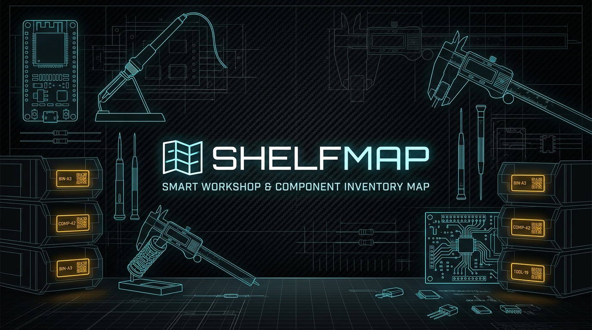
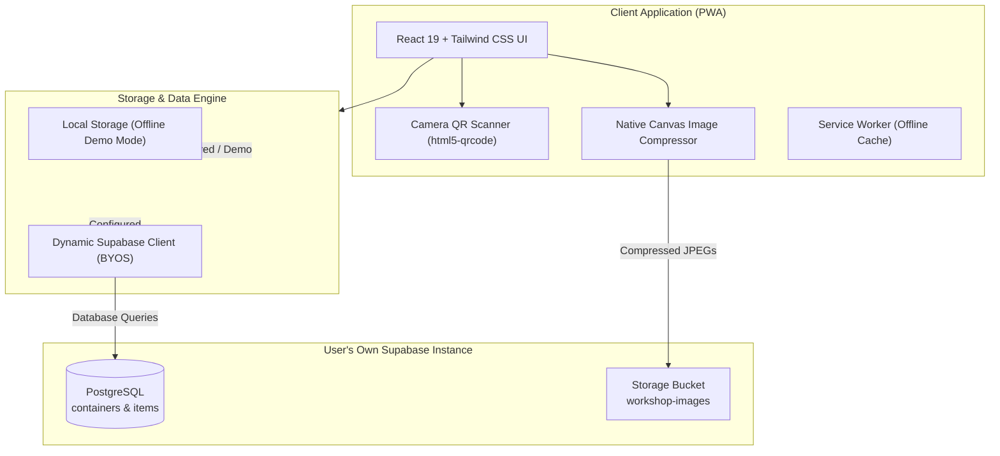

<div align="center">



# ShelfMap

**Hierarchical Workshop & Electronics Inventory Map (BYOS + PWA)**

[](https://github.com/AtaCanYmc/ShelfMap/actions/workflows/deploy.yml)
[](https://github.com/AtaCanYmc/ShelfMap/actions/workflows/release-please.yml)
[](LICENSE)

</div>

Hierarchical workshop and home storage mapping Progressive Web App (PWA) built for makers, electronics hobbyists, and developers. Organizes parts, boards, tools, and hardware across nested physical containers using a Bring-Your-Own-Supabase (BYOS) architecture, printable QR code labels, and live camera scanning.

---

## Table of Contents

- [Overview](#overview)
- [Architecture & Data Flow](#architecture--data-flow)
- [Key Features](#key-features)
- [Project Layout](#project-layout)
- [Quick Start](#quick-start)
- [Configuration & Storage Schema](#configuration--storage-schema)
- [Supabase Setup (BYOS)](#supabase-setup-byos)
- [Deployment](#deployment)
  - [GitHub Pages](#github-pages)
  - [Vercel](#vercel)
- [Automation & Governance](#automation--governance)
- [Testing & Verification](#testing--verification)
- [Frequently Asked Questions (FAQ)](#frequently-asked-questions-faq)
- [License](#license)

---

## Overview

Finding specific microcontrollers (e.g. ESP32, RP2040), sensors, hand tools, and mechanical fasteners across workshops, desks, drawers, and compartment boxes is a frequent bottleneck.

ShelfMap solves this by modeling physical storage spaces as an arbitrary-depth self-referential tree:

```text
Room / Lab ──> Storage Cabinet ──> Drawer 2 ──> Blue Tool Bag ──> Part
```

Every search result displays the exact hierarchical path from the root room down to the containing compartment.

---

## Architecture & Data Flow



---

## Key Features

- **Arbitrary Container Nesting**: Self-referencing tree model (`parent_id` foreign key) supports infinite nesting depths across rooms, cabinets, drawers, toolboxes, and organizers.
- **Cycle-Detection Engine**: Movement logic traverses the ancestor chain to prevent circular hierarchy loops (`wouldCreateCycle`).
- **Bring-Your-Own-Supabase (BYOS)**: Complete data sovereignty with zero hosting fees. API credentials remain stored locally in the browser, communicating directly with the user's personal Supabase project.
- **Offline Local Demo Mode**: Instant onboarding without requiring database configuration. Ships with pre-loaded maker mock inventory.
- **Client-Side Image Compression**: Reduces 10 to 15 MB mobile camera photos down to ~150 KB JPEG files directly inside the browser using HTML5 Canvas prior to upload. It requires zero third-party compression libraries.
- **Physical QR Code Generator & Scanner**:
  - Generates high-contrast QR labels formatted for adhesive sticker printing (`@media print`) with corner crop marks.
  - Scans QR labels with real-time autofocus via mobile back cameras (`facingMode: "environment"`).
  - Emits audio feedback via Web Audio API and navigates directly into the target container.
- **Instant Full-Path Search**: Real-time debounced queries return matched items alongside their breadcrumb chain.
- **Progressive Web App (PWA)**: Installable on iOS and Android home screens with standalone display and offline asset precaching.

---

## Project Layout

Grounded strictly in verified repository files on disk:

```text
ShelfMap/
├── .github/
│   ├── dependabot.yml              # Automated dependency scan schedule
│   └── workflows/
│       ├── deploy.yml              # GitHub Pages build and deployment
│       └── release-please.yml      # Semantic versioning and changelog automation
├── .husky/
│   └── pre-commit                  # Pre-commit test and build quality gate
├── public/
│   ├── favicon.svg                 # Application favicon
│   ├── pwa-192x192.png             # PWA home screen icon (standard)
│   └── pwa-512x512.png             # PWA splash screen icon (high-resolution)
├── src/
│   ├── components/                 # Hallmark workshop UI components
│   │   ├── Breadcrumbs.tsx         # Monospace path navigation bar
│   │   ├── ContainerCard.tsx       # Machined container preview card
│   │   ├── ContainerGrid.tsx       # Container collection grid
│   │   ├── ContainerHeader.tsx     # Location banner and action strip
│   │   ├── ContainerModal.tsx      # Container creation and edit dialog
│   │   ├── ImagePreviewModal.tsx   # Fullscreen technical lightbox
│   │   ├── ItemCard.tsx            # Component card with tabular stepper
│   │   ├── ItemList.tsx            # Inventory items collection grid
│   │   ├── ItemModal.tsx           # Item creation and edit dialog
│   │   ├── MoveModal.tsx           # Relocation dispatch dialog
│   │   ├── Navbar.tsx              # System status bar and global actions
│   │   ├── QrPrintModal.tsx        # Physical adhesive label generator
│   │   ├── QrScannerModal.tsx      # Optical camera scanner with reticle
│   │   ├── SearchView.tsx          # Command-palette parts search
│   │   └── SettingsModal.tsx       # BYOS Supabase and backup configuration
│   ├── services/                   # Core business logic and storage clients
│   │   ├── db.ts                   # Hierarchy tree, cycle detection, CRUD
│   │   ├── db.test.ts              # Unit tests for hierarchy and cycle checks
│   │   ├── imageUtils.ts           # Native HTML5 Canvas image compressor
│   │   ├── mockData.ts             # Default maker demo inventory
│   │   ├── sqlGenerator.ts         # Supabase PostgreSQL initialization script
│   │   └── supabaseClient.ts       # Dynamic client factory and health tester
│   ├── types/
│   │   └── index.ts                # Domain models (Container, Item, Config)
│   ├── App.tsx                     # Main application layout and modal state
│   ├── index.css                   # Hallmark workshop design system tokens
│   └── main.tsx                    # React 19 application entry point
├── CONTRIBUTING.md                 # Developer workflow and commit guidelines
├── LICENSE                         # Apache License, Version 2.0
├── package.json                    # Dependencies, scripts, and repository metadata
├── README.md                       # Repository overview and documentation
├── ROADMAP.md                      # Release milestones and planned features
├── SECURITY.md                     # Security policy and disclosure SLA
├── vercel.json                     # Vercel SPA routing and PWA headers
└── vite.config.ts                  # Vite 8 build, PWA manifest, chunk splitting
```

---

## Quick Start

### Prerequisites

- Node.js 20+ and npm

### Local Development

```bash
# Clone the repository
git clone https://github.com/AtaCanYmc/ShelfMap.git
cd ShelfMap

# Install dependencies
npm install

# Start the Vite development server
npm run dev
```

Open `http://localhost:5173` in your browser. ShelfMap launches immediately in Local Demo Mode populated with sample microcontrollers, tools, and hardware.

---

## Configuration & Storage Schema

ShelfMap operates client-side. Configuration parameters are stored in browser `localStorage`:

| Storage Key | Type | Default | Description |
| :--- | :--- | :--- | :--- |
| `shelfmap_supabase_config` | JSON Object | `{ useDemoMode: true }` | Stores user's personal Supabase Project URL and public anon key. |
| `shelfmap_containers` | JSON Array | Seed Maker Containers | Local offline container storage tree when running in demo mode. |
| `shelfmap_items` | JSON Array | Seed Maker Items | Local offline items and components inventory when running in demo mode. |

No environment files (`.env`) are mandatory for development because credentials are entered dynamically at runtime via the in-app Settings modal.

---

## Supabase Setup (BYOS)

To link ShelfMap to your personal cloud backend:

1. Create a free project at [Supabase](https://supabase.com).
2. Inside ShelfMap, click the **Settings (Database)** icon in the top navigation bar and select the **SQL Schema** tab.
3. Click **Copy SQL**.
4. In your Supabase Dashboard, navigate to **SQL Editor**, paste the copied script, and click **Run**:
   - Creates the `containers` and `items` tables with cascade foreign key relations.
   - Configures performance indexes and Row Level Security (RLS) policies.
   - Creates the public `workshop-images` storage bucket.
5. In your Supabase Dashboard, navigate to **Project Settings > API**:
   - Copy **Project URL**.
   - Copy **anon / public key**.
6. Paste these credentials into the ShelfMap **Settings** modal and click **Save Configuration**.

---

## Deployment

### GitHub Pages

This repository includes an automated GitHub Pages deployment workflow (`.github/workflows/deploy.yml`).

1. In your GitHub repository settings, navigate to **Settings > Pages**.
2. Under **Build and deployment > Source**, select **GitHub Actions**.
3. Push to `main` or trigger the workflow manually from the **Actions** tab.

The Vite build uses `base: './'` to guarantee asset paths resolve across GitHub Pages sub-paths (`https://<username>.github.io/<repo>/`).

### Vercel

The repository includes a production-ready `vercel.json` with Single Page Application (SPA) rewrites, PWA headers, and immutable asset caching.

#### Option 1: Vercel Dashboard
1. Import your GitHub repository into [Vercel](https://vercel.com/new).
2. The project settings are detected automatically:
   - **Framework Preset**: Vite
   - **Build Command**: `npm run build`
   - **Output Directory**: `dist`
3. Click **Deploy**.

#### Option 2: Vercel CLI
```bash
npx vercel --prod
```

---

## Automation & Governance

- **CI/CD Pipeline** (`.github/workflows/deploy.yml`): Runs automated unit tests (`npm run test:core`) and production compilation (`npm run build`) before deploying to GitHub Pages.
- **Dependabot** (`.github/dependabot.yml`): Automates weekly security scans and pull requests for both `npm` packages and `github-actions`.
- **Release Please** (`.github/workflows/release-please.yml`): Automates version bumping, `CHANGELOG.md` generation, and GitHub Releases based on [Conventional Commits](https://www.conventionalcommits.org/).
- **Husky Pre-Commit Hooks** (`.husky/pre-commit`): Executes tree traversal verification tests and type-checking before every `git commit`.

---

## Testing & Verification

Run the standalone core verification test suite:

```bash
# Run core logic tests (path resolution, cycle prevention, QR matching)
npm run test:core

# Run TypeScript check and production bundle compilation
npm run build
```

---

## Frequently Asked Questions (FAQ)

#### Why Bring Your Own Supabase (BYOS) instead of a hosted SaaS account?
A centralized service introduces hosting costs, subscription paywalls, and telemetry risks. With BYOS, you maintain total ownership of your workshop data on your personal free-tier Supabase project. ShelfMap communicates directly from your browser to your database with zero intermediary servers.

#### How does ShelfMap prevent infinite loops when relocating containers?
The relocation engine in `src/services/db.ts` executes `wouldCreateCycle(targetId, candidateParentId, allContainers)`. It walks upward along the ancestor chain from the candidate destination. If the target container itself is encountered anywhere in that ancestor line, the move is rejected before writing to state or database.

#### Why perform image compression directly on client canvas?
Mobile devices capture high-resolution camera photos ranging from 10 to 15 MB. Uploading raw files consumes unnecessary cloud storage bandwidth and fails in poor workshop connectivity. ShelfMap downsamples and compresses images to ~150 KB JPEG inside an in-memory HTML5 Canvas element before initiating upload. This operates fully client-side and requires zero server resources.

#### How are printable QR labels formatted for physical workshop bins?
The print layout is handled natively by CSS `@media print` rules in `src/index.css` and `src/components/QrPrintModal.tsx`. It produces clean adhesive labels with 1px borders, corner millimeter crop marks, monospace breadcrumb paths, and high-contrast QR codes. It supports both multi-column A4/Letter adhesive sheets and continuous thermal roll printers.

---

## License

This project is licensed under the [Apache-2.0 License](LICENSE) © 2026 Ata Can Yaymacı ([@AtaCanYmc](https://github.com/AtaCanYmc)).
